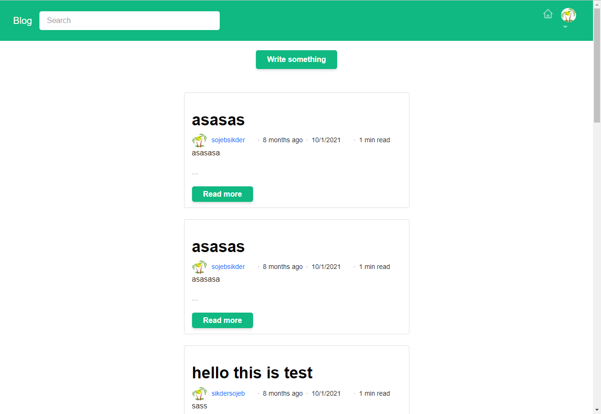
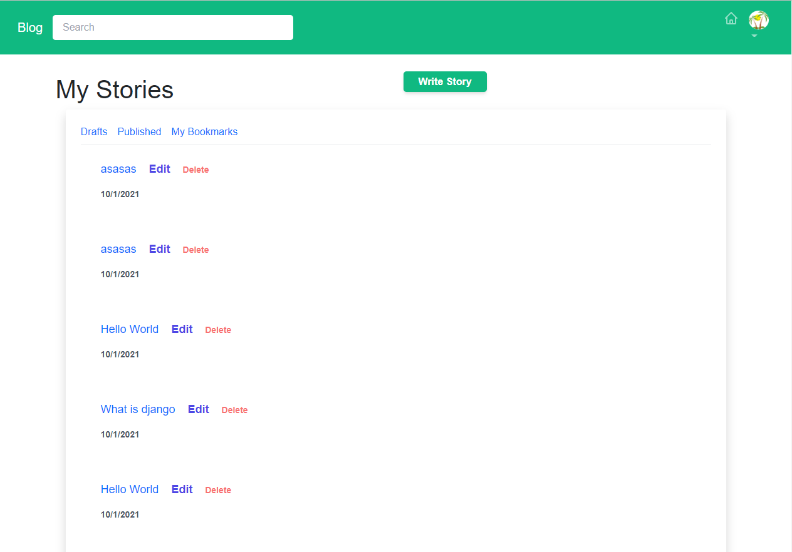

# blog

Blog app created with laravel and reactjs





## Installing

Install laravel dependency using composer:

```
composer install
```

Install react dependency using yarn:

```
yarn install
```

## Setup

-   Copy .env.copy to .env And set up database credentials in env file
-   run this command for database migration: `php artisan migrate`

## Running

First compile react app:

```
yarn prod
```

Run laravel app:

```
php artisan serve
```

## For development

Run this command for react app development:

```
yarn watch
```

## Technology used

-   Laravel
-   React js
-   Tailwind css

## For help and support

Email: sojebsikder@gmail.com

## Issue

If you find any problem please create an issue.
